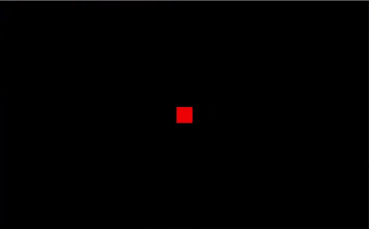

# Snake Game with JOGL (Java OpenGL)

This repository contains a Snake Game implementation using the Java JOGL library, along with a complete development kit setup.

---

# Part 1: Environment Setup

This section covers how to install the specific Java JDK, Eclipse IDE, and JOGL libraries required to run this project.

## Requirements

- **Java JDK**: 1.8.0_333 (Provided)
- **Library**: JOGL 2.0 (Provided)
- **IDE**: Eclipse (Provided)

## Step-by-Step Installation

### 1. Prerequisite Cleanup

- **Important**: Delete or uninstall any existing Eclipse IDE and Java SDK installations to avoid version conflicts. We must use the specific versions provided in `Setup.rar`.

### 2. JDK Installation & Configuration

1.  Extract the `Setup.rar` archive found in this repository.
2.  Install the JDK provided in the archive (JDK 1.8.0_333).
3.  **Environment Variables Setup**:
    - Navigate to the installation directory, commonly `C:\Program Files\Java\jdk1.8.0_333\bin`. Copy this path.
    - Open "Edit the system environment variables" on Windows.
    - **User Variables**:
      - Click `New`.
      - Variable Name: `JAVA_HOME`
      - Variable Value: Paste the path to the bin folder.
    - **System Variables**:
      - Find the `Path` variable and click `Edit`.
      - Click `New` and paste the same bin path.
      - Click `OK` to save.

### 3. Eclipse & JOGL Setup

1.  Install/Unzip the Eclipse IDE provided in `Setup.rar`.
2.  Move the `JOGL20` folder (from the setup files) to the root of your `C:\` drive (path must be `C:\JOGL20`).
3.  Open Eclipse.
4.  Go to `Window` -> `Preferences`.
5.  Navigate to `Java` -> `Build Path` -> `User Libraries`.
6.  Click `New`, type **JOGL**, and click `OK`.
7.  Select the new "JOGL" library and click `Add External JARs`.
8.  Navigate to `C:\JOGL20\lib` and select these 4 files:
    - `gluegen-rt.jar`
    - `jogl-all.jar`
    - `nativewindow-all.jar`
    - `newt-all.jar`
9.  **Native Library Configuration**:
    - Expand each of the 4 JAR listings in the User Library.
    - Select "Native library location", click `Edit`, and choose `External Folder`.
    - Select the `C:\JOGL20\lib` folder.
    - Repeat this for all 4 JARs.
10. Click `Apply and Close`.

### 4. Import/Create Project

1.  Create a new Java Project in Eclipse (e.g., `SnakeGame`).
2.  **JRE Selection**: select "Use a project specific JRE" and ensure `1.8.0_333` is selected.
3.  Click `Next` -> `Libraries` tab.
4.  Click `Add Library` -> `User Library` -> Select **JOGL**.
5.  Finish.
6.  Add the source code (`Snake.java`) to the `src` folder.

### 5. Running the Game

1.  Open `src/test/Snake.java`.
2.  Run the file as a Java Application.
3.  You should see the game window.

### Final Result

---

# Part 2: Snake Game Project

## Game Overview

This is a smooth-movement Snake game rendered using OpenGL (JOGL). The player controls a snake to eat food (dots), growing longer and faster with each point scored.

## How to Play

### Controls

Use the **WASD** keys to control the snake:

- **W**: Move Up
- **A**: Move Left
- **S**: Move Down
- **D**: Move Right

### Game Logic

1.  **Movement**: The snake moves constantly. You must change direction to navigate.
2.  **Screen Wrapping**: The game world is continuous. If you exit the screen on the right, you reappear on the left (and vice versa). Top/Bottom work the same way.
3.  **Growth**: Eating a green dot increases your score and length.
4.  **Speed**: As your score increases, the snake moves faster and the food disappears quicker!
5.  **Game Over**: The game ends if you collide with your own tail.

### Sounds

The game features dynamic audio feedback:

- **Background Music**: Loops while playing.
- **Eat**: Sound effect when collecting food.
- **Move**: Sound effect when changing direction.
- **Game Over**: Distinct sound when the game ends.

### Project Files

- `src/test/Snake.java`: Contains the main game loop, rendering logic (GLEventListener), and input handling (KeyListener).
- `Sound/`: Directory containing `.wav` files for game audio.
